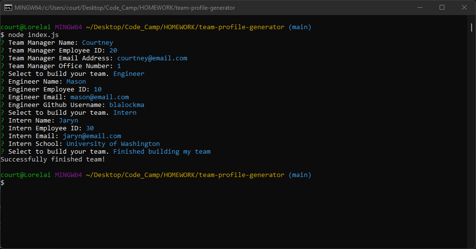
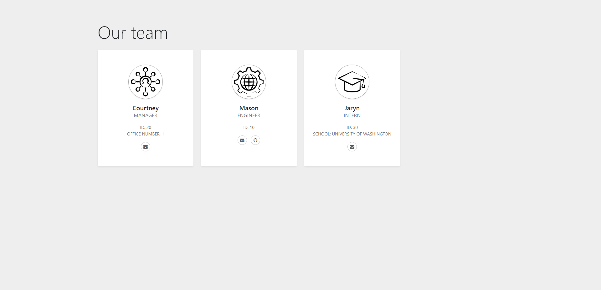

# team-profile-generator


[](https://opensource.org/licenses/MIT)

## Description

This is a Node.js command-line application that asks the user a series of prompts about their team. After filling out these prompts the application will generate a HTML page displaying information on their team.

The purpose of this project was to practice writing command-line applications using classes in javascript.

## Table of Contents

- [Installation](#installation)
- [Usage](#usage)
- [Deployment](#deployment)
- [License](#license)
- [Questions](#questions)

## Installation

You will need to have Node.js already installed on your computer.

1. Navigate to the "<> Code" tab of the project.
1. Click on the "Code" button on the right. A dropdown should appear.
1. Under "Clone", "HTTPS" should be selected.
1. Select "Download ZIP"
1. Extract the folder to where you'd like to save the readme-generator.
1. Using your console, navigate to the folder.
1. Once inside the folder in your console run the below command to install required node modules.

```
npm install
```

8. The team-profile-generator is ready for use.

## Usage

1. Open your preferred console.
1. Navigate to where you saved the team-profile-generator.
1. Once you're inside the folder in your console, use the below command to launch the application.

```
node index.js
```

4. A series of prompts will ask you questions about your team. Type your answer and click enter to move on to the next prompt.
1. When you're finished building your team select the `Finished building my team` option.
1. Your files will be saved within the team-profile-generator folder in the generated-files folder.

See below for a walk-through video.

https://youtu.be/OhHxy_4y2jY

## Deployment

Console Activity:



Sample Team: [Team HTML File](./Sample/index.html)



## License

See the [LICENSE](LICENSE.md) file for license rights and limitations (MIT License).

## Questions

Feel free to reach me on [GitHub](https://github.com/struelensc).
